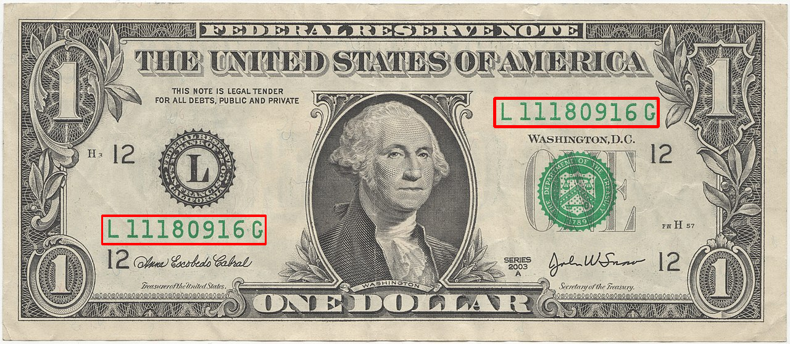
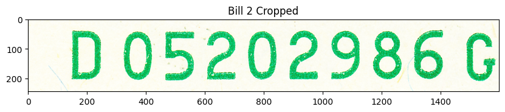

# Dollar Bill Serial Number OCR Practice

## Summary

I have a large collection of one dollar bills. My dad sent me an instagram reel of how different color serial numbers could sell for a high amount. I figured I would take pictures of all my 1s, but realized I could just look at the colors of the two serial numbers as I was collecting the data.

So instead I want to collect all of the serial numbers into a little database, then eventually search the mint date of each bill and see which ones are oldest, newest, if they're worth something, etc.

I'm mostly doing this for practice and learning more about opencv and OCRs, something I've been really wanting to do!

## OCR Notebook

I started out playing around with Opencv. I started out with reading images and manipulating them to prepare them for recognition

```python
# Read image
img_rgb = cv.imread('input/bill1.jpg')
assert img_rgb is not None, "file could not be read, check path"

# Convert to grayscale
img_gray = cv.cvtColor(img_rgb, cv.COLOR_BGR2GRAY)
template = cv.imread('input/bill1_template.jpg', cv.IMREAD_GRAYSCALE)
assert template is not None, "file could not be read, check path"
w, h = template.shape[::-1]
```

I started the OCR part by reading all the text on a dollar bill, but it gave back a soup of strings which wasn't very useful. So I scrapped that and read more into edge detection which lead me down a rabbit hole of templates, thresholds, and detection of objects using TM_COEFF_NORMED as the matchTemplate model.

I followed [this](https://docs.opencv.org/4.x/d4/dc6/tutorial_py_template_matching.html) guide of template matching from opencv but applied to it bills. I managed to match a template cropped from the bill I was trying to match... which is redundant, but I still thought it was neat. 

```python
res = cv.matchTemplate(img_gray,template,cv.TM_CCOEFF_NORMED)
threshold = 0.8
loc = np.where( res >= threshold)

for pt in zip(*loc[::-1]):
 cv.rectangle(img_rgb, pt, (pt[0] + w, pt[1] + h), (0,0,255), 2)

cv.imwrite('output/bill1_output.png', img_rgb)
```


Using the template from bill1 and attempting to match it to bill2 and so on was definitely not going to work, so I started looking into combing opencv with tesseract

## Tesseract Notebook

Dollar bill serial numbers are always in the top left and bottom right of the bill. So I would start this process by finding the relative position of the serial number since the image size can vary. I would just have to make sure the image of the bill is cropped to the edges, which can later be done with edge detection once I take pictures of all the bills. (right now i'm working with images found from wikipedia commons)

Once I found the relative position I was able to crop the image to fit the serial number and, after some preprocessing, run Tesseract's image_to_string to get the text

```python
img = cv2.imread(f'input/bill{i}.jpg')
assert img is not None, "file could not be read, check path"

# serial num pos
height, width = img.shape[:2]
x_abs = int(x * width)
y_abs = int(y * height)
w_abs = int(w * width)
h_abs = int(h * height)

# crop
img_cropped = img[y_abs:y_abs+h_abs, x_abs:x_abs+w_abs]


# show crop
plt.figure(figsize=(10, 10))
plt.imshow(cv2.cvtColor(img_cropped, cv2.COLOR_BGR2RGB))
plt.title(f'Bill {i} Cropped')
plt.show()
```


```
Bill 2: D05202986G
```

I used Bill 2 as this example because Bill 1 kept mistakenly adding another 6 at the end of the string. I don't expect 100% accuracy but when I do this en masse I'd like to have it be pretty smooth. But for spending a few hours on this, I'm happy with the results so far.

## Future Endeavors

* Automatic cropping
* Data storage
* Automatic data lookup

The images will be taken manually (and hopefully with the help of a friend), so they're not going to be perfectly aligned or uniform, so I want to see if I can automate the process of cropping. I setup a directory called `source_img` with subdirectories `precrop` and `cropped`. The raw images will go into precrop and then I'll run a script that detects the edges and crops the image around the bill

I need to store the serial numbers in a light weight database. Later I'll try to find an API where I can programmatically lookup things and stuff about the bills like mint date and maybe uniqueness/value of the bill. TBD
