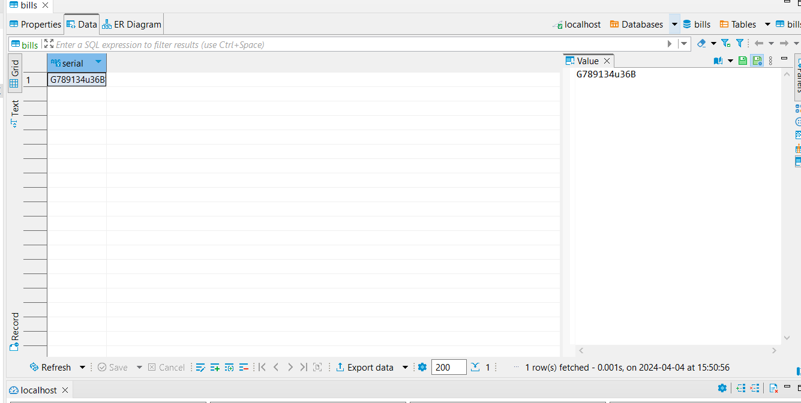

# Dollar Bill Serial Number OCR Practice

## Summary

I have a large collection of one dollar bills. My dad sent me an instagram reel of how different color serial numbers could sell for a high amount. I figured I would take pictures of all my 1s, but realized I could just look at the colors of the two serial numbers as I was collecting the data.

So instead I want to collect all of the serial numbers into a little database, then eventually search the mint date of each bill and see which ones are oldest, newest, if they're worth something, etc.

I'm mostly doing this for practice and learning more about opencv and OCRs, something I've been really wanting to do!

** I'm basically using this readme as a journal, so that's why it may seem disorderly.

## OCR Notebook

I started out playing around with Opencv. I started out with reading images and manipulating them to prepare them for recognition

```python
# Read image
img_rgb = cv.imread('input/bill1.jpg')
assert img_rgb is not None, "file could not be read, check path"

# Convert to grayscale
img_gray = cv.cvtColor(img_rgb, cv.COLOR_BGR2GRAY)
template = cv.imread('input/bill1_template.jpg', cv.IMREAD_GRAYSCALE)
assert template is not None, "file could not be read, check path"
w, h = template.shape[::-1]
```

I started the OCR part by reading all the text on a dollar bill, but it gave back a soup of strings which wasn't very useful. So I scrapped that and read more into edge detection which lead me down a rabbit hole of templates, thresholds, and detection of objects using TM_COEFF_NORMED as the matchTemplate model.

I followed [this](https://docs.opencv.org/4.x/d4/dc6/tutorial_py_template_matching.html) guide of template matching from opencv but applied to it bills. I managed to match a template cropped from the bill I was trying to match... which is redundant, but I still thought it was neat. 

```python
res = cv.matchTemplate(img_gray,template,cv.TM_CCOEFF_NORMED)
threshold = 0.8
loc = np.where( res >= threshold)

for pt in zip(*loc[::-1]):
 cv.rectangle(img_rgb, pt, (pt[0] + w, pt[1] + h), (0,0,255), 2)

cv.imwrite('output/bill1_output.png', img_rgb)
```


Using the template from bill1 and attempting to match it to bill2 and so on was definitely not going to work, so I started looking into combing opencv with tesseract

## Tesseract Notebook

Dollar bill serial numbers are always in the top left and bottom right of the bill. So I would start this process by finding the relative position of the serial number since the image size can vary. I would just have to make sure the image of the bill is cropped to the edges, which can later be done with edge detection once I take pictures of all the bills. (right now i'm working with images found from wikipedia commons)

Once I found the relative position I was able to crop the image to fit the serial number and, after some preprocessing, run Tesseract's image_to_string to get the text

```python
img = cv2.imread(f'input/bill{i}.jpg')
assert img is not None, "file could not be read, check path"

# serial num pos
height, width = img.shape[:2]
x_abs = int(x * width)
y_abs = int(y * height)
w_abs = int(w * width)
h_abs = int(h * height)

# crop
img_cropped = img[y_abs:y_abs+h_abs, x_abs:x_abs+w_abs]


# show crop
plt.figure(figsize=(10, 10))
plt.imshow(cv2.cvtColor(img_cropped, cv2.COLOR_BGR2RGB))
plt.title(f'Bill {i} Cropped')
plt.show()
```


```
Bill 2: D05202986G
```

I used Bill 2 as this example because Bill 1 kept mistakenly adding another 6 at the end of the string. I don't expect 100% accuracy but when I do this en masse I'd like to have it be pretty smooth. But for spending a few hours on this, I'm happy with the results so far.

## Edge Detection and Cropping

Before writing scripts I like to breakdown the process in a notebook, so I created edge_detection.ipynb. I loaded the image and used Canny edge detection to make an outline of the edges. I want to crop the image to the edges so I then used numpy to find the min and max x,y values of the edges. I used those values and cropped the image by slicing with the x,y minmax dimensions.

At first I used a real picture of one of my bills, but I made the mistake of taking the picture on the back of my Children of Dune book, which has three circles engraved into the hardback cover. It technically did crop to the edges, but it picked up the circles so it's not to the bill


I went online and found a decent test image for some vintage bill so I used that instead and found better results


## Database

I chose MariaDB as the database primarily because I've never used it. I'm only really familiar with postgresql so I know my way around SQL pretty well, but I wanted to try a different flavor. I fleshed out `serial_extraction.py` and managed to get the cropped image ran through Tesseract, extract the serial as string and INSERT it into my bills table, so success.

However the serial is innacurate. Tesseract added a random 'u' in the middle so I need to figure out how to either make it more accurate or find something else. I may resort to copilot to generate code but I really only use it for code completion out of fear of over using it as a crutch. This project after all is for learning new things.



## EasyOCR Notebook

I figured out the dpi of my cropped images were 96 x 96. The optimal dpi for Tesseract is at least 300, so I started looking into other python OCR libraries. I tried out using a pretrained Tensorflow model but utterly failed. I found EasyOCR and had really good results.

I tested my image on their [demo site](https://www.jaided.ai/easyocr/). I liked the bounding boxes and the display of the probability table so I wanted to emulate that.

I created the easyocr notebook, ran my image through the reader, picked apart the data to see how it was structured, then had copilot generate the plot with all the bounding boxes on it.

```python
# setup reader
reader = easyocr.Reader(['en'])

#setup image
image_path ='input/real_bill.jpg'
image = mpimg.imread(image_path)

# read text in image, check data structure
result = reader.readtext(image)
display(result)

# >>>matplotlib ai code here<<<
```

The end result is pretty cool

```
                           Text  Probability
17                            3     1.000000
10                            3     1.000000
9                             3     1.000000
7                  C 70244669 A     0.837232
12                 C 70244669 A     0.781033
13                            3     0.734737
8                   WSHINGTONEC     0.686424
1   ME UNTTEI) STATES OFAMERICA     0.683572
20                     DEDULLAR     0.377502
3                         LECAL     0.352041
16                  Gnet % Yse~     0.247924
6            Fubiic And PRivaTe     0.164762
2                          LOTF     0.161385
15                        52028     0.155480
4                        TENDER     0.144917
11                          736     0.099522
5                     CoRADEKTS     0.030436
14              Trn @efeo Ieeta     0.005127
0            HHHEAHFHUEZEDHHOVE     0.001943
19                    ~fnK{rncI     0.000153
18                  OtetCnetoca     0.000075
```

Moving forward I'm going to use EasyOCR. It also gets rid of the edge detection and cropping process. Which kinda hurts my love for rube goldberg machines but at least it's easy and efficient.

## Data Collection with webcam

I knew collecting the data would be a nightmare if I went with the photo route. I still want to have saved images to run through the code I previously wrote, but manually taking those images would take too long. I saw a Redditor's python project on /r/madeinpython that would read live video data to drive an RC car. I think I'm going to try to use the webcam to take a snapshot of the bill in frame, or modify the previous code to insert the serial as it's detected.

## Future Endeavors

* Automatic cropping :white_check_mark:
* Data storage :white_check_mark:
* Streamlined data collection
* API data lookup
* Analytics with R

The images will be taken manually (and hopefully with the help of a friend), so they're not going to be perfectly aligned or uniform, so I want to see if I can automate the process of cropping. I setup a directory called `source_img` with subdirectories `precrop` and `cropped`. The raw images will go into precrop and then I'll run a script that detects the edges and crops the image around the bill

I need to store the serial numbers in a light weight database. Later I'll try to find an API where I can programmatically lookup things and stuff about the bills like mint date and maybe uniqueness/value of the bill. TBD

After I'm satisfied with the data I want to finally use R to visualize the data. I'm familiar with pandas, matplotlib, seaborn, etc but I've never used R